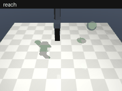

# robo-evals

**Seeded, reproducible success rates for robot manipulation policies in MuJoCo, with confidence intervals and episode videos.**

[](https://github.com/superintelligenceco/robo-evals/actions/workflows/ci.yml)
[](LICENSE)

[](https://pypi.org/project/robo-evals/)
[](https://scorecard.dev/viewer/?uri=github.com/superintelligenceco/robo-evals)
[](https://superintelligenceco.github.io/robo-evals/)
[](https://codespaces.new/superintelligenceco/robo-evals)



You register a policy (a Python callable, or a model behind an HTTP or WebSocket server), pick a
task suite, and get back per-task success rates with Wilson confidence intervals, a JSON and
Markdown report, and MP4 or GIF videos of the episodes you ask for. Every scene is derived from a
base seed, so the same command gives the same numbers on any machine with the same MuJoCo build.

## Install

Pick one of these. Each gives you the `robo-evals` command.

### PyPI

```sh
pip install "robo-evals[video]"
```

The `video` extra adds MP4 output. Add `ws` for WebSocket policy servers.

### Standalone executable (Linux, macOS on Apple silicon)

One file, no Python needed. The installer checks the download against the release's `SHA256SUMS`:

```sh
curl -fsSL https://raw.githubusercontent.com/superintelligenceco/robo-evals/main/install.sh | sh
```

Set `ROBO_EVALS_VERSION=v0.2.0` to pin a version and `ROBO_EVALS_INSTALL_DIR` to change the
target directory (default `~/.local/bin`). Windows users can download `robo-evals-windows-x86_64.zip`
from the [latest release](https://github.com/superintelligenceco/robo-evals/releases/latest).

### Container image (Linux amd64 and arm64)

The image renders offscreen with OSMesa, so videos work on any host without a GPU or a display.
Mount a directory at `/out`, and the reports and videos land in it:

```sh
mkdir -p out
docker run --rm --user "$(id -u):$(id -g)" -v "$PWD/out:/out" \
  ghcr.io/superintelligenceco/robo-evals:latest \
  run --policy scripted --suite smoke --episodes 5 --video first --video-format mp4
# out/results/scripted/report.md, report.json, videos/reach_ep000.mp4, videos/push_ep000.mp4
```

Tags: `:vX.Y.Z` and `:latest` for releases, `:edge` for a manual build from `main`.

To evaluate your own policy file, mount it and pass its path. This example runs
[`examples/my_policy.py`](examples/my_policy.py):

```sh
docker run --rm --user "$(id -u):$(id -g)" -v "$PWD/out:/out" -v "$PWD/examples:/policies:ro" \
  ghcr.io/superintelligenceco/robo-evals:latest \
  run --policy /policies/my_policy.py:ReachPolicy --tasks reach --episodes 5
```

To evaluate a policy server on the host, add `--network host` and pass
`--policy http://127.0.0.1:<port>`.

### Wheel from the latest release

```sh
pip install "robo-evals[video] @ https://github.com/superintelligenceco/robo-evals/releases/latest/download/robo_evals-<version>-py3-none-any.whl"
```

Replace `<version>` with the release version, for example `0.2.0`. Each release also carries the
sdist (`robo_evals-<version>.tar.gz`) and a `SHA256SUMS` file.

### From source

```sh
pip install "robo-evals[video] @ git+https://github.com/superintelligenceco/robo-evals"
```

On headless Linux outside the container, install EGL or OSMesa for videos (see
[Rendering and video](#rendering-and-video)).

## Quickstart

```sh
robo-evals run --policy scripted --suite core --episodes 20 --video first
robo-evals run --policy path/to/my_policy.py:MyPolicy --suite core --episodes 20
```

Each run writes `results/<policy>/report.json`, `report.md`, and `videos/`. On a headless Linux
machine, robo-evals picks `MUJOCO_GL=egl` for you. Use `MUJOCO_GL=osmesa` if you have no GPU and
no EGL driver.

## Baseline results

Two reference policies on the `core` suite, 50 episodes per task, base seed 0, `default`
randomization. Cells show the success rate, the 95% Wilson interval, and successes out of
episodes.

| Task | `random` | `scripted` |
| --- | --- | --- |
| reach | 0.0% [0.0, 7.1] (0/50) | 100.0% [92.9, 100.0] (50/50) |
| push | 0.0% [0.0, 7.1] (0/50) | 100.0% [92.9, 100.0] (50/50) |
| pick_place | 0.0% [0.0, 7.1] (0/50) | 100.0% [92.9, 100.0] (50/50) |
| drawer | 0.0% [0.0, 7.1] (0/50) | 100.0% [92.9, 100.0] (50/50) |
| stack | 0.0% [0.0, 7.1] (0/50) | 100.0% [92.9, 100.0] (50/50) |
| **overall** | **0.0% [0.0, 1.5] (0/250)** | **100.0% [98.5, 100.0] (250/250)** |

Produced with robo-evals 0.1.0, MuJoCo 3.14.0, Python 3.12 on Linux aarch64. Reproduce it with
`examples/compare_baselines.sh`. The scripted policy reads ground-truth object positions, so treat
it as an upper bound that proves each task is solvable, not as a learned result. It needs a mean
of 9 (reach) to 31 (stack) control steps to succeed.

## Why it exists

Robot learning papers and model cards often report a success rate from a handful of rollouts, with
no interval, no seed, and no video. Two numbers like "70%" and "80%" from 10 episodes each are not
distinguishable, and you can't rerun the scenes that produced them. robo-evals makes the boring
parts fixed:

- **Same seed, same scenes.** Each episode seed derives from the base seed, the task name, and the
  episode index. Adding a task or reordering the suite never changes the scenes of another task.
- **Intervals, not point estimates.** Every rate comes with a Wilson score interval, which stays
  honest at 0% and 100%.
- **Evidence.** Videos of the first episode, of every failure, or of every episode.
- **Any policy.** Anything that maps an observation to an action works, in process or over the
  network, so you can evaluate a large model without importing it into the harness.

## Task catalog

All tasks share one scene: a table and a floating two-finger gripper driven by end-effector
position targets. Actions are `[dx, dy, dz, grip]` in `[-1, 1]`. One control step moves the target
up to 3 cm and runs 25 physics steps (20 Hz control, 2 ms timestep).

| Task | Instruction | Success predicate | Step limit |
| --- | --- | --- | --- |
| `reach` | move the gripper to the green target | grip point within 3 cm of the target | 60 |
| `push` | push the red cube into the green circle | cube center within 5 cm of the goal disc center (xy) | 150 |
| `pick_place` | pick up the blue cube and move it to the green target | cube center within 3 cm of a goal 8 to 20 cm above the table | 150 |
| `drawer` | open the drawer | drawer joint opened more than 12 cm | 120 |
| `stack` | stack the red cube on top of the blue cube | red cube within 2 cm (xy) and 8 mm (z) of resting on the blue cube, with the gripper open | 180 |

Suites: `core` runs all five tasks, `smoke` runs `reach` and `push`. Run `robo-evals list` to see
them with the randomization presets.

### Domain randomization

Every random draw in an episode comes from one generator seeded with the episode seed.

| Knob | What it varies | Presets |
| --- | --- | --- |
| `object_pose` | Object, goal, cabinet, and start pose ranges, scaled from 0 (fixed at range centers) to 1 | `none`: 0, `default` and `wide`: 1 |
| `friction` | A per-episode multiplier on the sliding friction of every geom | `none`: 1.0, `default`: 0.8 to 1.2, `wide`: 0.6 to 1.4 |
| `lighting` | Light position, intensity, and ambient level (render only, never physics) | `none`: off, `default` and `wide`: on |

Choose a preset with `--randomization`, or pass `Randomization(...)` to `evaluate` in Python.

## Policy interface

A policy is any callable from an observation to an action:

```python
class MyPolicy:
    def reset(self, task: str, seed: int) -> None:  # optional, called before every episode
        ...

    def __call__(self, obs: dict) -> list[float]:  # [dx, dy, dz, grip], each in [-1, 1]
        ...
```

`grip` is `-1` for fully open and `1` for fully closed. The observation holds:

| Key | Shape | Meaning |
| --- | --- | --- |
| `ee_pos` | (3,) | Grip point position in metres |
| `gripper` | (1,) | Finger opening, 1 = fully open |
| task keys | varies | `goal_pos`, `object_pos`, `target_pos`, `handle_pos`, or `drawer_open` |
| `state` | (n,) | All of the above, concatenated in order |
| `instruction` | str | The task's language instruction |
| `image` | (H, W, 3) uint8 | Front camera image, only with `--image-obs` |

`--policy` accepts `random`, `scripted`, `zero`, `package.module:attr`, `path/to/file.py:attr`, or
a server URL. If `attr` is a class or a function with no required arguments, robo-evals calls it
once to build the policy. See [`examples/my_policy.py`](examples/my_policy.py).

### Remote policies

Serve a model in its own process, environment, or machine, and point the harness at it:

```sh
robo-evals serve --policy my_pkg.model:load --port 8765            # or run your own server
robo-evals run --policy http://127.0.0.1:8765 --suite core --image-obs
```

The protocol (`robo-evals/1`) is small JSON over HTTP or WebSocket. Read
[`docs/protocol.md`](docs/protocol.md) for the message format, and start from
[`examples/policy_server.py`](examples/policy_server.py), a dependency-free server that you can
drop next to a LeRobot or OpenVLA checkpoint by replacing one function. WebSocket support needs
`pip install "robo-evals[ws]"`.

## Metrics

For each task, `report.json` holds:

- `success_rate`: successes divided by episodes. An episode succeeds the first time the predicate
  holds, and ends there.
- `ci_low`, `ci_high`: the Wilson score interval at `--confidence` (95% by default). With
  `k` successes in `n` episodes and normal quantile `z`, the center is
  `(p + z²/2n) / (1 + z²/n)` and the half-width is `z·sqrt(p(1-p)/n + z²/4n²) / (1 + z²/n)`.
- `mean_steps_to_success`: mean control steps over successful episodes.
- `episode_results`: every episode's seed, outcome, step count, and video path.

`overall` pools every episode across tasks and also reports `mean_task_success_rate`, the
unweighted mean of the task rates. Compare runs side by side with
`robo-evals compare results/a/report.json results/b/report.json`.

## Reproducibility

- Results are deterministic for a given robo-evals version, MuJoCo version, and platform. The test
  suite checks that two runs with the same seed produce identical reports and trajectories.
- MuJoCo does not promise bit-identical physics across versions or CPU architectures. Every report
  records the robo-evals, MuJoCo, NumPy, and Python versions and the platform, so pin
  `mujoco` when you publish numbers.
- The random baseline is seeded from the episode seed too, so even random rollouts replay exactly.
- Lighting randomization changes only rendered pixels. State-based policies see the same episode
  with lighting on or off.

## Rendering and video

Videos and image observations need an OpenGL context. On Linux without a display, robo-evals sets
`MUJOCO_GL=egl` unless you set it yourself. If the backend is missing or broken, robo-evals logs a
warning, disables rendering, skips videos, and still scores every episode. The report states that
videos were unavailable. Image observations are the exception: they fail loudly, because a vision
policy can't run without them. MP4 output needs `imageio-ffmpeg` (the `video` extra); without it,
robo-evals writes GIFs. The container image sets `MUJOCO_GL=osmesa` and ships OSMesa and
`imageio-ffmpeg`, so both formats work there out of the box.

## Python API

```python
from robo_evals import Randomization, evaluate, load_policy
from robo_evals.report import write_reports

result = evaluate(
    load_policy("scripted"),
    suite="core",
    episodes=20,
    seed=0,
    randomization=Randomization(object_pose=1.0, friction=(0.6, 1.4)),
    video="failures",
    video_dir="results/videos",
)
write_reports(result, "results/scripted")
print(result.overall)
```

## Roadmap

- More tasks: peg insertion, door opening, and multi-step rearrangement with language variations.
- Camera randomization (pose and field of view) and texture randomization for vision policies.
- A rotating wrist and a 7-DoF arm scene, alongside the floating gripper.
- Additional simulator backends such as ManiSkill and Isaac Lab. None exist yet; the task and
  policy interfaces are kept backend-neutral so they can be added without changing reports.
- Parallel episode execution across processes.

## Contributing

Read [CONTRIBUTING.md](CONTRIBUTING.md) to set up the project and add a task. Report security
problems as described in [SECURITY.md](SECURITY.md). This project follows the
[Contributor Covenant](CODE_OF_CONDUCT.md).

## Citation

If you use robo-evals in research, cite it with the metadata in [CITATION.cff](CITATION.cff).

## License

[Apache-2.0](LICENSE)
