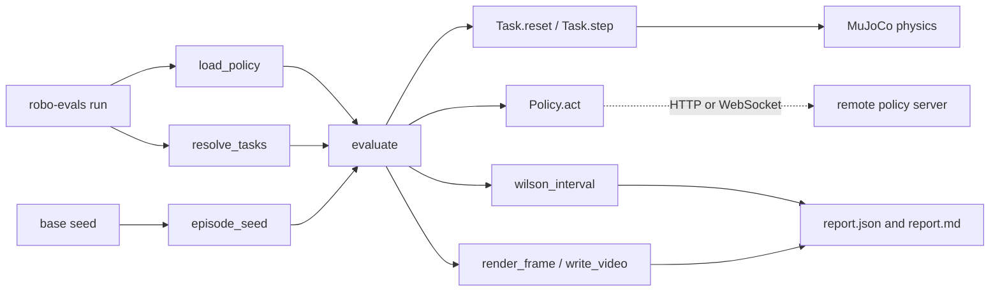

# Architecture

A run turns three inputs (a policy, a task suite, and a base seed) into per-task success rates
with confidence intervals.

## Modules

| Module | Role |
| --- | --- |
| `cli` | Parses arguments for `run`, `compare`, `list`, and `serve`. |
| `policy`, `policies` | The `Policy` protocol, the built-in baselines, and policy loading from a name, a file, or a URL. |
| `tasks`, `env` | The five tasks (reach, push, pick-and-place, drawer, stack) on a shared MuJoCo scene. |
| `randomization` | Per-episode scene randomization: object pose, friction, and lighting. |
| `seeding` | Derives one seed per episode from the base seed, the task name, and the episode index. |
| `runner` | The evaluation loop. It steps each episode until the success predicate holds or the step limit is reached. |
| `stats` | Wilson score intervals. |
| `video` | Offscreen rendering, MP4 and GIF writing. Rendering degrades gracefully when no GL backend exists. |
| `remote` | The `robo-evals/1` client and a reference server. |
| `report` | JSON and Markdown reports, and side-by-side comparison. |

## One episode

1. `episode_seed(base, task, index)` yields the seed.
2. `Task.reset(seed)` places the scene, applying the randomization.
3. Until success or the step limit, `Policy.act(observation)` returns `[dx, dy, dz, grip]`, and
   `Task.step(action)` advances 25 physics substeps.
4. The episode records its seed, outcome, and step count. The runner renders video only for the
   episodes you asked for.
