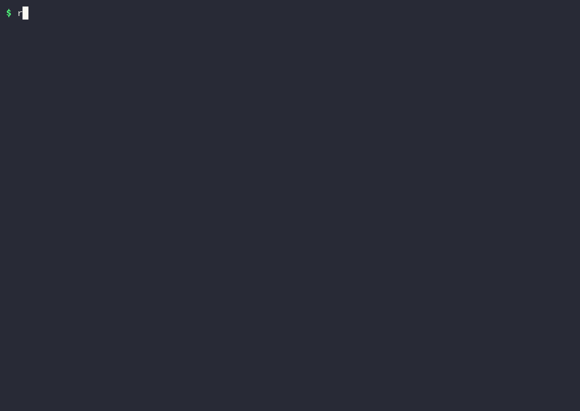

# robo-evals

Seeded, reproducible success rates for robot manipulation policies in MuJoCo, with confidence
intervals and episode videos.



The recording above is a real session with the released command line, not a mock-up.

## Install

=== "PyPI"

    ```sh
    pip install "robo-evals[video]"
    ```

=== "Standalone executable"

    ```sh
    curl -fsSL https://raw.githubusercontent.com/superintelligenceco/robo-evals/main/install.sh | sh
    ```

=== "Container"

    ```sh
    docker run --rm --user "$(id -u):$(id -g)" -v "$PWD/out:/out" \
      ghcr.io/superintelligenceco/robo-evals:latest \
      run --policy scripted --suite smoke --episodes 5
    ```

## Run it

```sh
robo-evals run --policy scripted --suite core --episodes 20 --video first
robo-evals compare results/random/report.json results/scripted/report.json
```

Each run writes `report.json`, `report.md`, and videos under `results/<policy>/`.

## Where to go next

- [Architecture](architecture.md) shows how a run flows from the command line to a report.
- [Remote policy protocol](protocol.md) explains how to evaluate a model in another process.
- [FAQ](faq.md) answers the common questions about seeds, intervals, and rendering.
- [Decisions](adr/index.md) records why the harness works the way it does.
